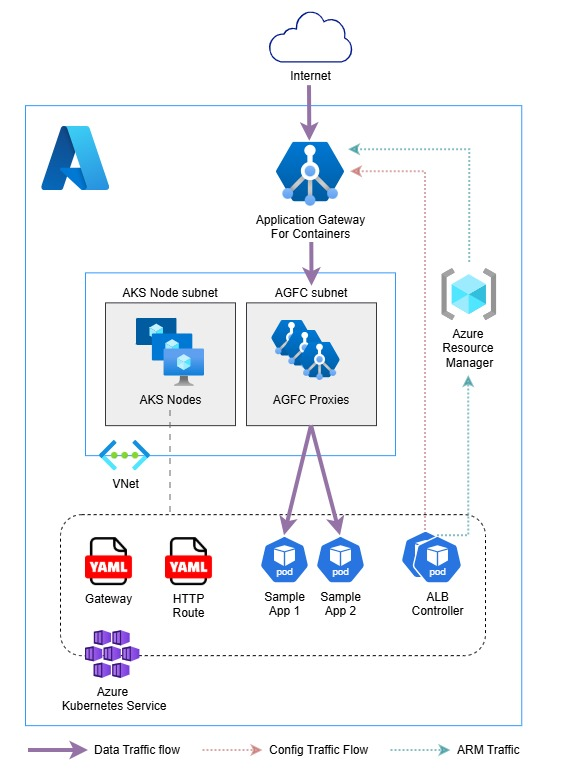

# AKS multi site routing with Application Gateway For Containers (BYO)

This lab demonstrates how to implement multi site routing with Application Gateway For Containers with Azure Kubernetes Service.

> **Note:**
> For this demo, we will use the `bring your own deployment` method of Application Gateway For Containers deployment. 

## Architecture Overview

- An Azure Kubernetes Service (AKS) cluster:
    - A small system node pool hosting alb-controller pods and two lightweight hello world applications.
- An Application Gateway For Containers (AGFC) resource with a Frontend and Subnet Association
- A Virtual Netwrok to host AKS and AGFC
- A User Managed Identity for AGFC federation with the AKS cluster



After deployment, you will:
- Deploy the lightweight applications
- Install ALB Controller using HELM
- Deploy a Gateway resource in K8s
- Deploy an Http Routing resource in K8s

## Prerequisites

Before you begin, ensure you have:
- terraform >= 1.10.5 installed
- azure-cli >= 2.69.0 installed
- kubectl >= 1.35.0 installed
- helm >= 3.19.4 installed

Run below commands to make sure your subscription is ready for the deployment:
```bash
# Sign in to your Azure subscription.
SUBSCRIPTION_ID='<your subscription id>'
az login
az account set --subscription $SUBSCRIPTION_ID

# Register required resource providers on the Azure subscription
az provider register --namespace Microsoft.ContainerService
az provider register --namespace Microsoft.Network
az provider register --namespace Microsoft.NetworkFunction
az provider register --namespace Microsoft.ServiceNetworking

# Install Azure CLI extension
az extension add --name alb
```

## Quick Start

### 1. Create AKS credentials

Create a key pair for AKS credentials on your local machine:
```bash
mkdir -p ~/.ssh/aks-sshkeys
ssh-keygen -m PEM -t rsa -b 4096 -f ~/.ssh/aks-sshkeys/aks-cluster
```

### 2. Update variables.tf

Open `variables.tf` and update the following inputs:

| Variable | Description |
|----------|-------------|
| `subscription_id` | Your Azure subscription ID |
| `aks_admin_group` | An Azure Entra ID group name containing your account to be used for AKS administrators |
| Other optional variables | Update as needed for your environment |

Example:

```hcl
variable "subscription_id" {
  type        = string
  description = "Azure subscription id to deploy resources within"
  default = "00000000-0000-0000-0000-000000000000"
}

variable "aks_admin_group" {
  type        = string
  description = "Entra ID group name for AKS administrators"
  default = "Sandbox AKS Administrators"
}
```

### 3. Deploy the environment

Run below from the `infra` folder:

```bash
terraform init
terraform plan
terraform apply
```

Deployment takes approximately **5 minutes**.

### 4. Configure AKS Credentials
Run below commands to get access to Kubernetes API:
```bash
az login
AKS_NAME='<your AKS cluster name>'
RESOURCE_GROUP='<your AKS resource group name>'

az aks get-credentials --resource-group $RESOURCE_GROUP --name $AKS_NAME
kubelogin convert-kubeconfig -l azurecli
kubectl config get-contexts
```

### 5. Deploy Applications

Run below command from `manifests` folder to deploy the two lightweight hellow world applications:

```bash
kubectl apply -f application.yaml
```

This command creates the following on your cluster:

- A namespace called sample-app
- Two services called backend-1 and backend-2 in the sample-app namespace
- Two deployments called backend-1 and backend-2 in the sample-app namespace

Run below command to validate the deployment of the apps: 

```bash
kubectl get pods -n sample-app
```

### 6. Install ALB Controller

Run below commands to isntall the ALB Controller for the AKS cluster using Helm charts:

```bash
HELM_NAMESPACE='azure-alb-system'
CONTROLLER_NAMESPACE='azure-alb-system'
RESOURCE_GROUP='<your AKS resource group name>'
MANAGED_IDENTITY='<your Application Gateway For Containers User Assigned Managed Identity name>'

helm install alb-controller oci://mcr.microsoft.com/application-lb/charts/alb-controller \
     --namespace $HELM_NAMESPACE \
     --version 1.8.12 \
     --create-namespace \
     --set albController.namespace=$CONTROLLER_NAMESPACE \
     --set albController.podIdentity.clientID=$(az identity show -g $RESOURCE_GROUP -n $MANAGED_IDENTITY --query clientId -o tsv)
```

Verify that ALB Controller pods are ready:
```bash
kubectl get pods -n azure-alb-system
```

Verify GatewayClass azure-alb-external is installed on the cluster:
```bash
kubectl get gatewayclass azure-alb-external -o yaml
```

### 7. Deploy Gateway
Replace the `<RESOURCE_ID>` and `<FRONTEND_NAME>` values within the `gateway.yaml` file with the correct values from your deployment above.

You can also run below command to query the values:

```bash
RESOURCE_GROUP='<resource group name where Application Gateway For Containers is deployed>'
AGFC_NAME='<Application Gateway For Containers resource name>'

RESOURCE_ID=$(az network alb show --resource-group $RESOURCE_GROUP --name $AGFC_NAME --query id -o tsv)

echo $RESOURCE_ID

FRONTEND_NAME=$(az network alb frontend list --resource-group $RESOURCE_GROUP --alb-name $AGFC_NAME --query "[0].name" -o tsv)

echo $FRONTEND_NAME
```

Run below command to deploy the gateway in K8s:

```bash
kubectl apply -f gateway.yaml
```

Validate the status of the gateway and make sure the listener is Programmed using below command:

```bash
kubectl get gateway gateway-01 -n sample-app -o yaml
```

### 8. Creat HTTP Routes
Deploy the http routes using below command to provide routing to the backends:

```bash
kubectl apply -f httproute.yaml
```

Run below commands to ensure both HTTPRoute resources show `Accepted` and the Application Gateway for Containers resource is `Programmed`:

```bash
kubectl get httproute contoso-route -n sample-app -o yaml
kubectl get httproute fabrikam-route -n sample-app -o yaml
```

## Testing

You can use below command to retrieve the FQDN of the frontend:
```bash
fqdn=$(kubectl get gateway gateway-01 -n sample-app -o jsonpath='{.status.addresses[0].value}')
```

Next, use `nslookup` or below command to retrieve the public IP of the FQDN:
```bash
fqdnIp=$(dig +short $fqdn)

echo $fqdnIp
```

> **Note:**
> In this example, we used `contoso.com` and `fabrikam.com` for HTTP routing. Since you don’t have access to these domains, you can override DNS resolution locally with curl like below.

```bash
curl -k --resolve contoso.com:80:$fqdnIp http://contoso.com
curl -k --resolve fabrikam.com:80:$fqdnIp http://fabrikam.com
```

If you prefer to use your own domains:

1. Update the hostnames section in `httproute.yaml` with your domain names.

2. Create a CNAME record in your public DNS zone or domain registrar pointing to the frontend FQDN `($fqdn)`.

After that, you can access the application directly via curl or a web browser using your own domains.

## Cleanup

To remove all deployed resources:

```bash
terraform destroy
```

## License

This project is provided for learning purposes. You may reuse or modify it as needed.
