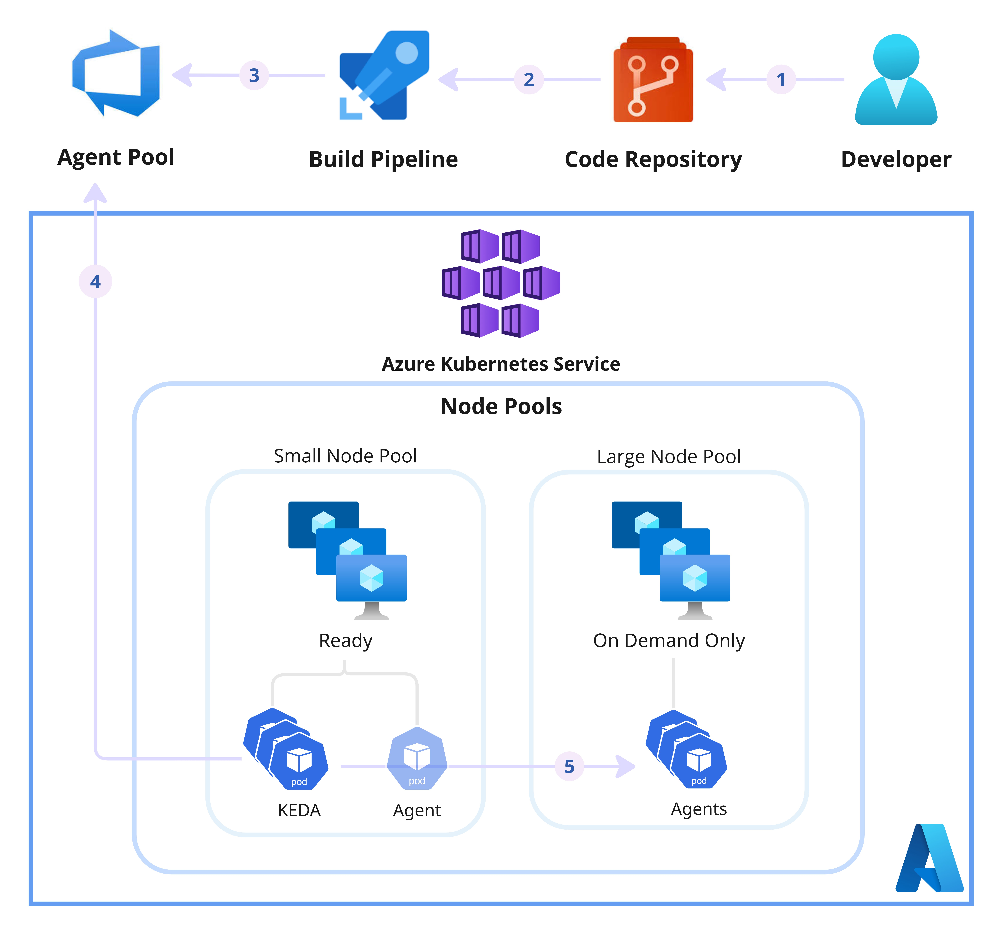

# Azure DevOps Self-Hosted Agents on AKS with Scale-to-Zero

This lab demonstrates how to run Azure DevOps self-hosted build agents on Azure Kubernetes Service (AKS) while achieving true scale-to-zero for both pods and nodes.

It is designed for scenarios where CI workloads require large amounts of compute, but only run sporadically (for example, a few hours per month). Instead of keeping oversized infrastructure running 24/7, this architecture provisions capacity only when pipelines are queued and scales everything back down automatically when builds complete.

>**Note**
> The cluster and VM sizes are selected small intentionally to lower the cost of running this lab.

>**Notes**
> This is one possible implementation of scale-to-zero CI on AKS. Other approaches, services (i.e. Virtual Machine Scale Sets) variations may be equally valid depending on organizational constraints, security requirements and tooling preferences.

## Architecture Overview

- An AKS cluster with Using Infrastructure as Code (IaC):
    - A small system node pool hosting KEDA and a lightweight agent to prevent Azure DevOps pipeline failures when no agents are available
    - A small, tainted user node pool dedicated exclusively to "compute-intensive" build agents
- An Azure DevOps self-hosted agent pool
- KEDA deployment to:
    - Poll Azure DevOps pipeline queues
    - Dynamically create build agent pods only when work is available



After deployment, you will configure:
- Deploy KEDA using HELM
- A self-hosted agent pool in Azure DevOps
- A Kubernetes Secret
- A Kubernetes lightweight agent deployment
- A Kubernetes Keda ScaledJob Deployment

## Prerequisites

Before you begin, ensure you have:
- terraform >= 1.10.5 installed
- azure-cli >= 2.69.0 installed
- kubectl >= 1.35.0 installed
- helm >= 3.19.4 installed

## Quick Start

### 1. Create AKS credentials

Create a key pair for AKS credentials on your local machine:
```bash
mkdir -p ~/.ssh/aks-sshkeys
ssh-keygen -m PEM -t rsa -b 4096 -f ~/.ssh/aks-sshkeys/aks-cluster
```

### 2. Update variables.tf

Open `variables.tf` and update the following inputs:

| Variable | Description |
|----------|-------------|
| `subscription_id` | Your Azure subscription ID |
| `aks_admin_group` | An Azure Entra ID group name containing your account to be used for AKS administrators |
| Other optional variables | Update as needed for your environment |

Example:

```hcl
variable "subscription_id" {
  type        = string
  description = "Azure subscription id to deploy resources within"
  default = "00000000-0000-0000-0000-000000000000"
}

variable "aks_admin_group" {
  type        = string
  description = "Entra ID group name for AKS administrators"
  default = "Sandbox AKS Administrators"
}
```

### 3. Deploy the environment

Run:

```bash
terraform init
terraform plan
terraform apply
```

Deployment takes approximately **5 minutes**.

### 4. Configure AKS Credentials
Run below commands to get access to Kubernetes API:
```bash
az login
az aks get-credentials --resource-group <rg-name> --name <aks-name>
kubelogin convert-kubeconfig -l azurecli
kubectl config get-contexts
```

### 5. Deploy KEDA
Deploy KEDA into your AKS cluster using Helm:
```bash
helm install keda kedacore/keda \
  --namespace keda --create-namespace \
  --set operator.nodeSelector."kubernetes\.azure\.com/agentpool"=systempool \
  --set admissionWebhooks.nodeSelector."kubernetes\.azure\.com/agentpool"=systempool \
  --set operatorMetrics.nodeSelector."kubernetes\.azure\.com/agentpool"=systempool
```

Run below command to make sure KEDA is deployed properly:
```bash
kubectl get pods -n keda
```

### 6. Creat Azure DevOps Agent Pool
Create an Azure DevOps Agent pool called **aks-selfhosted**

### 7. Creat PAT for Azure DevOps Agent Pool Access
Create a personal access token (PAT) with below permissions to manage the agent pools:
- Agent Pools (Read & manage)
- Read Audit Log
- Build (Read & Execute)
- Project and Team (Read)
- User Profile (Read)

> **Note**
> For production scenarios, use service principals or managed identities for enhanced security. PATs are used here for simplicity in the lab.

### 8. Encode the PAT and Deploy Kubernetes Secret
Use the following command to encode your PAT for use in the lab:
```bash
echo -n "your-pat-token" | base64
```

> **Warning**
> Base64 encoding is not encryption, so it shouldn't be pushed to the code. For secure handling in real deployments, store secrets in Azure Key Vault or use Pipeline secret variables. The method here is only for lab simplicity.

Now replace the ``<base64-encoded-ADOPAT>`` with the encoded value earlier within the secret.yaml file (only for lab don't push to repo) and run below command to save it in your cluster:
```bash
kubectl apply -f secret.yaml
```

Run below to make sure it's saved:
```bash
kubectl get secret
```

### 9. Deploy Lightweight Agent
Replace ``<organization>`` with your Azure DevOps Organization name in the `lightweight-agent.yaml` file. 

Use the following command to deploy a lightweight agent in the Azure DevOps pool agent.
```bash
kubectl apply -f lightweight-agent.yaml
```

This agent is just to make sure pipelines won't fail if there are no agents present in the pool. You should go to Azure DevOps pools that you created earlier and disabled it if you don't want it to be used for your builds.

> **Note**
> You can build and use your own Azure DevOps agents using [Microsoft documentation](https://learn.microsoft.com/en-us/azure/devops/pipelines/agents/docker?view=azure-devops). For the purpose of this lab, you can use the public agent provided in the manifest configuration.

### 10. Deploy KEDA Scaled Job
Replace ``<organization>`` with your Azure DevOps Organization name and ``<pool-id>`` with the pool ID of the Azure DevOps agent pool that you created earlier  in the `keda-scaled-jobs.yaml` file. 

Use the following command to deploy a KEDA scaled job that will populate the user node pool with Azure DevOps Agents once jobs are queued for it, making the node to scale up and down.
```bash
kubectl apply -f lightweight-agent.yaml
```

Run below command to make sure all deployments are successful:
```bash
kubectl get all
```

## Testing Scaling and Pipeline Runs

You can now run pipelines targeting the **aks-selfhosted** agent pool and observe the scaling behavior in action.

A sample Azure DevOps pipeline is available in the test folder for you to try.

## Cleanup
To remove all deployed resources:

```bash
terraform destroy
```

## License

This project is provided for learning purposes. You may reuse or modify it as needed.
