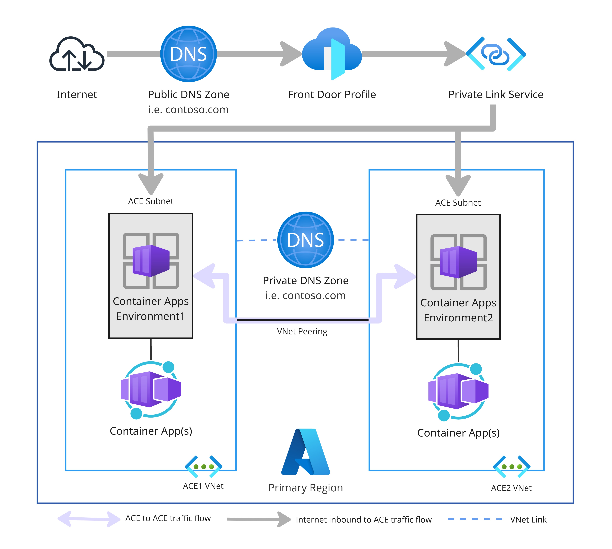

# Azure Container App Environments Private/Public Connectivity Lab

This lab deploys a fully functional environment on Azure using Terraform, demonstrating how to build two isolated Azure Container Apps Environments, each in its own VNet, with:

- Private service-to-service communication using VNet peering and custom domain names
- Public access to both services through Azure Front Door with split DNS

It is intended for anyone who wants to learn how to provide HTTP connectivity between Container Apps within different Container App Environments while enabling public access through Azure Front Door. This represents one approach to solving this use case. Other suitable architectures can be used to provide internal connectivity, such as using DAPR with Azure Service Bus integration or other messaging patterns.

## Architecture Overview

The Terraform deployment includes:

- Two Azure Container Apps Environments, each in its own VNet
- A small Container App in each environment for testing
- VNet peering between the VNets for private communication
- A private DNS zone for internal custom domain resolution
- A public DNS zone to support external domain resoltuion for Azure Front Door
- Azure Front Door Premium routing traffic to both Container Apps
- Split-horizon DNS (public + private) for the same custom domain



After deployment, you will configure:

- Public DNS delegation (one-time manual step)
- TLS certificates for each Container Apps Environment
- Domain binding for each Container App

## Prerequisites

Before you begin, ensure you have:

- An Azure subscription
- A custom domain that you own (e.g., `contoso.com`)
- A valid certificate for your custom domain
- Azure CLI installed
- Terraform >= 1.10 installed
- Permissions to create Azure resources (Contributor recommended)

## Quick Start

### 1. Clone the repository

```bash
git clone https://github.com/siavashhub/azure-architecture.git
cd azure-architecture/network/ace-afd-dnsh
```

### 2. Update variables.tf

Open `variables.tf` and update the following inputs:

| Variable | Description |
|----------|-------------|
| `subscription_id` | Your Azure subscription ID |
| `custom_domain_zone_name` | The root domain you own (e.g., `contoso.com`) |
| Other optional variables | Update as needed for your environment |

Example:

```hcl
variable "subscription_id" {
  type        = string
  description = "Azure subscription id to deploy resources within"
  default = "00000000-0000-0000-0000-000000000000"
}

variable "custom_domain_zone_name" {
  type        = string
  description = "Custom domain zone name to be used for AFD and ACA custom domains"
  default     = "contoso.com"
}
```

### 3. Deploy the environment

Run:

```bash
terraform init
terraform plan
terraform apply
```

Deployment takes approximately **45 minutes**.

When complete, Terraform will output:

- `public_dns_zone_name_servers` (Required for public DNS delegation)

### 4. Configure DNS Delegation (Public Traffic)

Locate the Terraform output:

```
public_dns_zone_name_servers = [
  "ns1-xxxx.azure-dns.com.",
  "ns2-xxxx.azure-dns.net.",
  "ns3-xxxx.azure-dns.org.",
  "ns4-xxxx.azure-dns.info."
]
```

In your domain registrar, create NS records for your custom domain (e.g., `contoso.com`) pointing to these name servers.

> **Note:**  
> This step can be automated via IaC (e.g., Terraform with supported DNS providers), but is manual here to keep the lab platform-agnostic and simple.

### 5. Configure Certificates for Private Connectivity

Each Azure Container Apps Environment requires a TLS certificate for the custom domain.

You must upload:

- One certificate per Container Apps Environment, or
- A single wildcard certificate (e.g., `*.contoso.com`) can be used in both

**Upload certificates:**

1. Navigate to each Container Apps Environment
2. Go to **Certificates** under **Settings**
3. Upload your PFX certificate
4. Enter the certificate password
5. Save

### 6. Bind Custom Domains to Container Apps

For each Container App:

1. Open the Container App
2. Go to **Custom Domains** under **Networking**
3. Click on **Add binding** next to the custom domain that was created (e.g., `app1service.contoso.com`)
4. Select the available certificate that was uploaded to the environment
5. Click Add

This enables private traffic resolution via the internal private DNS zone and public access through Azure Front Door.

> **Note:**  
> Certificate management and binding can also be automated by storing certificates in Azure Key Vault and using Terraform to populate the environment.

## Traffic Flow Summary

### Internal Traffic (Private Access)

- Uses VNet peering
- Uses private DNS zone for name resolution

### External Traffic (Public Access)

- Enters through Azure Front Door
- Uses the public DNS zone

## Testing Connectivity

After deployment, you can test both public and private connectivity using the provided Terraform output values.

### Public Access Test

Use the `app1_test_url` and `app2_test_url` outputs from Terraform to test public access through Azure Front Door:

```bash
curl https://app1service.contoso.com/ping
curl https://app2service.contoso.com/ping
```

The response will include a `client_ip` field showing the public IP address that hits Azure Front Door.

### Private Access Test

To test private connectivity between Container Apps:

1. Navigate to one of the Container Apps in the Azure Portal
2. Open the **Console** tab
3. Run curl commands to access the other app:

```bash
curl https://app2service.contoso.com/ping
```

The response will include a `client_ip` field showing the private IP address from the VNet, confirming that traffic is flowing through the private network via VNet peering rather than the public internet.

This demonstrates the split-horizon DNS setup where the same domain resolves differently depending on whether you're accessing it from within the Azure VNet (private) or from the public internet (via Front Door).

## Cleanup

To remove all deployed resources:

```bash
terraform destroy
```

## License

This project is provided for learning purposes. You may reuse or modify it as needed.