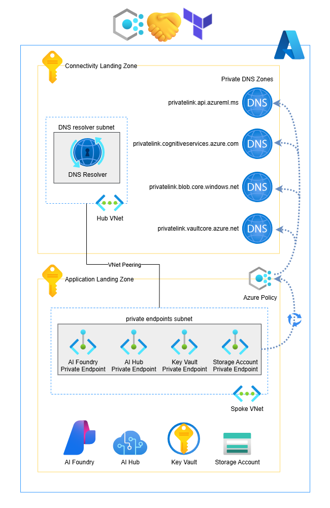

# Azure Policy-Based Private DNS Automation for PaaS Private Endpoints

This lab demonstrates how to automate the lifecycle management of DNS records for PaaS private endpoints in a single, global private endpoint architecture.

It is designed for scenarios where access to platform landing zones and shared Private DNS zones is restricted and application teams need their services to automatically integrate with enterprise-managed DNS when deploying application infrastructure, either manually or through Infrastructure as Code (IaC).

>**Notes**
> - A Private DNS Resolver is not deployed to reduce the cost of this lab and is not required to demonstrate the solution.
> - A hub virtual network and VNet peerings are not deployed, as they are also not required for demonstrating how this solution works.

## Architecture Overview

- Connectivity platform landing zone DNS deployment (via IaC):
  - Selected Private DNS zones to host A records for PaaS services deployed in later phases.
  - Azure Policy definitions and assignments scoped to the management group hosting application landing zones.
  - A managed identity used by Azure Policy for DNS remediation tasks.
- Sample application landing zone deployment (via IaC):
    - Selected PaaS services to demonstrate different private endpoint and DNS integration scenarios.
      - Azure Key Vault with a private endpoint
      - Azure Storage account with a private endpoint
      - Azure AI Hub with a private endpoint
      - Azure AI Foundry with a private endpoint
  
>**Notes**
> - Organizations may use different pipelines and workflows for policy deployment than what is shown here. The approach demonstrated in this lab is a simplified example intended to illustrate the solution and its behavior.
> - If platform resources and policies are deployed using the Microsoft Verified Azure Landing Zone Accelerator and modules, the required Private DNS zones and policies may already be in place.



## Prerequisites

Before you begin, ensure you have:
- terraform >= 1.10.5 installed
- azure-cli >= 2.69.0 installed

## Quick Start

### 1. Update connectivity platform variables.tf

Open `variables.tf` under the `connectivity` folder and update the following inputs:

| Variable | Description |
|----------|-------------|
| `subscription_id` | Your Azure subscription ID for the Connectivity Landing Zone |
| `top_level_management_group_display_name` | The management group display name that contains your application landing zones and subscriptions. This is where the DNS lifecycle policy will be applied to. |
| Other optional variables | Update as needed for your environment |

Example:

```hcl
variable "subscription_id" {
  type        = string
  description = "Azure subscription id to deploy resources within"
  default = "00000000-0000-0000-0000-000000000000"
}

variable "top_level_management_group_display_name" {
  type        = string
  description = "Top Level Management Group Display Name for Policy Assignment Scope"
  default = "Landing Zones"
}
```

### 3. Deploy the connectivity landing zone resources

Run below terraform commands under the `connectivity` folder:

```bash
terraform init
terraform plan
terraform apply
```

Deployment takes approximately **3 minutes**.


### 4. Update sample application landign zone variables.tf

Open `variables.tf` under the `sample-landingzone` and update the following inputs:

| Variable | Description |
|----------|-------------|
| `subscription_id` | Your Azure subscription ID for the sample application Landing Zone, it can be the same as before if you only have one subscription to test. |
| Other optional variables | Update as needed for your environment |

Example:

```hcl
variable "subscription_id" {
  type        = string
  description = "Azure subscription id to deploy resources within"
  default = "00000000-0000-0000-0000-000000000000"
}
```

### 5. Deploy the sample application landing zone resources

Run below terraform commands under the `sample-landingzone` folder:

```bash
terraform init
terraform plan
terraform apply
```

Deployment takes approximately **5 minutes**.

## Testing

You can now check each of the Private DNS Zones to see them being populated with the DNS records of the private endpoints that you have deployed for the PaaS resources.

To test record cleanup now run below command under the `sample-landingzone` folder to destroy all the sample application landing zone resources:

```bash
terraform destroy
```

Once done you can check the Private DNS Zones again and validate that the records are cleaned up.

## Cleanup
To remove all deployed resources run the Terraform destory command under the `connectivity` folder as well:

```bash
terraform destroy
```

## License

This project is provided for learning purposes. You may reuse or modify it as needed.


